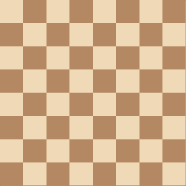

# knights-tour
[Wiki](https://en.wikipedia.org/wiki/Knight%27s_tour)

The knight's tour problem is an ancient puzzle whose goal is to find out how to construct a series of legal moves made by a knight so that it visits every square of a chessboard exactly once.

The given project visually solves the given puzzle. The knight finds his way on a chessboard of any size and from any cell. 

In the process of finding the way the Warnsdorf rule is used, which is a kind of greedy algorithm for finding the horse's route.

> Warnsdorff's rule is a heuristic for finding a single knight's tour. The knight is moved so that it always proceeds to the square from which the knight will have the fewest onward moves. When calculating the number of onward moves for each candidate square, we do not count moves that revisit any square already visited. It is possible to have two or more choices for which the number of onward moves is equal.

## [Demo](https://find-knight-tour.netlify.com/)
